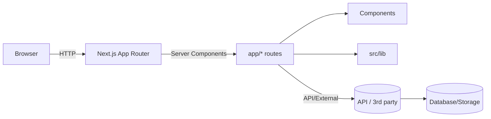

# Project Architecture — keyz

## Overview

A concise architecture guide for this Next.js 14 (App Router) project. Covers folder structure, component responsibilities, routing, data flow, state management, testing, and deployment recommendations.

## Tech stack

- Next.js (App Router)
- React + Server Components
- TypeScript
- Tailwind/PostCSS (project uses PostCSS config)
- pnpm

## High-level structure

- app/: App router entry points, layouts, and pages
- src/components/: Reusable UI components and small atoms
  - ui/: Design-system-style primitives (buttons, inputs)
- lib/: Utilities and shared logic
- public/: Static assets

## Routing & pages

- Uses Next.js App Router with nested layouts.
- Routes exist under `app/` and `(marketing)/` is a parallel route group for marketing pages.

## Components

- Keep pure presentational components under `src/components/ui`.
- Page-level composition and data fetching live in `app/*` server components.
- Use Client Components only when interactivity/state hooks are required (add 'use client').

## Data fetching

- Prefer server-side data fetching using async Server Components and fetch on the server.
- For client-driven requests, create a thin API route (or use external API) and fetch from client components.

## State management

- Local UI state: React local state or Context for medium-sized state.
- Shared global state: lightweight solutions (Zustand, Jotai) if needed — avoid Redux unless required.

## Styling

- Use component-level CSS modules or Tailwind utilities.
- Global styles live in `app/globals.css`.

## Utilities & lib

- Place helpers, formatters, and feature-agnostic utilities in `src/lib`.

## Testing

- Unit & component tests with Vitest or Jest + React Testing Library.
- Add a small integration test suite for major flows.

## CI / CD

- Suggested: GitHub Actions or Vercel for deployments.
- Run lint, typecheck, and tests on PRs; deploy on merge to main.

## Accessibility & Best Practices

- Use semantic HTML, focus management, and keyboard navigation.
- Add Lighthouse and axe checks in CI as optional steps.

## Conventions

- Files use kebab-case for pages and components; PascalCase for React components.
- Export single default React component per file where appropriate.
- Keep components small and focused (max ~200 lines).

## Diagram (Mermaid)

## Next steps

- Add small ADRs (architecture decision records) for long-lived decisions.
- Add tests and CI pipeline stub.

---

Generated on 2026-05-24.
