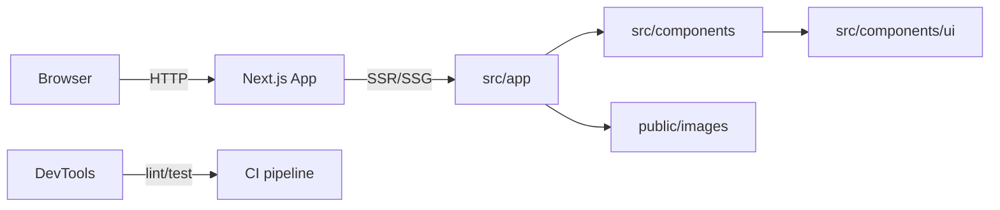

# Architecture Overview

This document describes the high-level architecture, folder layout, data flow, component conventions, and operational notes for this Next.js (App Router) project.

## Goals

- Keep UI code modular and reusable
- Use the App Router and server/client boundaries where appropriate
- Simple, accessible, and performant landing/marketing site
- Minimal runtime state; favor local component state and forms

## High-level diagram

## Folder layout (core)

- `src/app` — application routes and layouts. Primary entry: [src/app/page.tsx](src/app/page.tsx).
- `src/components` — page-level and shared components (Hero, Navbar, Footer, etc.).
- `src/components/ui` — low-level UI primitives and design-system pieces.
- `src/lib` — utilities and helpers (`src/lib/utils.ts`).
- `public/images` — static assets.
- Top-level config: `next.config.ts`, `postcss.config.mjs`, `tsconfig.json`.

## Routing and data flow

- Use the App Router conventions: route files under `src/app/*` map to URLs.
- Keep server-only logic in server components (default in App Router); mark components `"use client"` only when they need client-side hooks or browser APIs.
- Data fetching: prefer `fetch()` in server components or use Next.js route handlers for API-like endpoints if needed.

## Components and conventions

- Components in `src/components` should be small, focused, and composable.
- Naming: PascalCase for components (e.g., `Navbar`, `HeroSection`).
- File exports: default export the component and also export types/interfaces where useful.
- UI primitives in `src/components/ui` are generic and should avoid business logic.

Example conventions:

- Presentational components: pure functions, accept props, minimal hooks.
- Stateful components: local state via `useState` / `useReducer`; lift state up only when necessary.

## Styling

- Tailwind CSS is the primary styling system (see `tailwindcss` and `postcss` in `package.json`).
- Use utility classes and `class-variance-authority` / `clsx` for complex variants.
- Keep visual tokens in Tailwind config; prefer component-level class composition in `src/components/ui`.

## Forms and validation

- `react-hook-form` + `zod` for schema validation. Keep validation schemas colocated with form components or in `src/lib/validation` when shared.

## State management

- Prefer local component state. For cross-cutting concerns, add a lightweight context provider in `src/components`.
- Avoid heavy global state libs unless requirements change.

## Utilities & third-party libraries

- Utilities: `src/lib/utils.ts` for general helpers.
- Key deps: `framer-motion` (animations), `lucide-react` (icons), `radix-ui` (accessible primitives), `date-fns`, `zod`, `react-hook-form`.

## Testing & linting

- ESLint is configured and available via the `lint` script in `package.json`.
- Add unit tests with a lightweight runner (Jest or Vitest) if components grow; prefer component-focused tests and accessibility checks.

## Build & deployment

- Build with `next build` and run with `next start` (see `build` and `start` scripts in `package.json`).
- Deploy on Vercel for optimal Next.js support, or any host that supports Next.js Node server.

## Environment variables

- Keep secrets in environment variables and do not commit them. Add a `.env.example` to document required values.

## Performance & accessibility

- Optimize images in `public/images` and prefer Next's image optimization when adding remote images.
- Use semantic HTML and ARIA where necessary. Ensure keyboard navigation for interactive components.

## Contributing guidelines (quick)

- Add new page: create folder/file under `src/app/{route}/page.tsx` and update any shared layout if needed.
- Add component: create file in `src/components` or `src/components/ui` and export from an index file if you want a grouped import surface.
- Lint locally: `pnpm run lint` and consider `--fix`.

## Troubleshooting

- If dev server fails, check Node version (use modern Node matching Next.js 16 requirements) and reinstall deps (`pnpm install`).
- For runtime issues, inspect server build output with `pnpm run build` and review error traces.

## Next steps (suggested)

- Add a small architecture diagram to README or wiki.
- Add `./.github/workflows/ci.yml` with lint and build checks.
- Add `CONTRIBUTING.md` with PR and branching guidelines.

---

This file is a living document—update it when major architecture or dependency decisions change.
